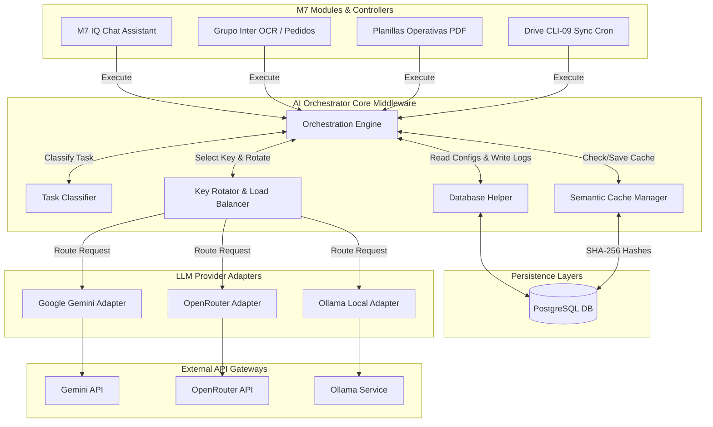

# AI Orchestrator Enterprise - Technical Architecture & Roadmap

This document serves as the official implementation guide and blueprint for the **AI Orchestrator Enterprise** designed for **Orbit M7**. It details the current architectural shortcomings, the proposed middleware solution, database schemas, folder structures, API contracts, security practices, and a phased rollout plan.

---

## 1. Diagnosis of the Current Architecture

Currently, the Generative AI calls inside Orbit M7 are tightly coupled, duplicated across controllers, and highly vulnerable to API quota constraints.

### Identified Bottlenecks & Failure Points
1. **API Key Saturation & Timeouts:** Multiple files (`document.controller.ts`, `grupoInter.controller.ts`, `planillas-operativas.controller.ts`) independently parse the comma-separated `GEMINI_API_KEY` from environment variables. There is no shared coordination, leading to race conditions where one high-volume batch job (e.g. CLI-09 cron sync) exhausts the entire pool and blocks manual user actions.
2. **Duplicate Fallback Logic:** The fallback model lists `["gemini-2.0-flash", "gemini-2.5-flash", "gemini-flash-latest"]` are hardcoded in multiple places. If a model name is deprecated or added, it requires updating multiple source files.
3. **No Centralized Cost & Latency Auditing:** The platform has no consolidated view of how many tokens are consumed, the financial impact per client/module, or model response latencies.
4. **Lack of Semantic Caching:** Repetitive processes, such as re-dispatched PDF receipts, trigger redundant LLM calls. This increases cost and triggers 429 Rate Limits.
5. **Single-Provider Dependency:** The backend is dependent on Google Gemini. If Google's servers experience degraded availability, there are no immediate adapters to failover to other providers (DeepSeek, Llama, Qwen, local Ollama).

---

## 2. Proposed Architecture Design

The **AI Orchestrator Enterprise** acts as an independent middleware service between Orbit M7 business logic and Generative AI providers.



---

## 3. Database Schema

The orchestrator utilizes five PostgreSQL tables to manage providers, active models, rotated API keys, execution logs, and semantic cache records.

```sql
-- 1. Providers Table
CREATE TABLE IF NOT EXISTS ai_providers (
    id VARCHAR(100) PRIMARY KEY,
    name VARCHAR(255) NOT NULL,
    status VARCHAR(50) DEFAULT 'active' CHECK (status IN ('active', 'inactive', 'degraded')),
    priority INTEGER DEFAULT 1,
    created_at TIMESTAMP DEFAULT CURRENT_TIMESTAMP,
    updated_at TIMESTAMP DEFAULT CURRENT_TIMESTAMP
);

-- 2. Models Table
CREATE TABLE IF NOT EXISTS ai_models (
    id VARCHAR(100) PRIMARY KEY,
    provider_id VARCHAR(100) REFERENCES ai_providers(id) ON DELETE CASCADE,
    name VARCHAR(255) NOT NULL,
    task_types TEXT[] NOT NULL,
    cost_per_1k_input_tokens NUMERIC(10, 6) DEFAULT 0,
    cost_per_1k_output_tokens NUMERIC(10, 6) DEFAULT 0,
    context_window INTEGER DEFAULT 8192,
    is_multimodal BOOLEAN DEFAULT false,
    status VARCHAR(50) DEFAULT 'active' CHECK (status IN ('active', 'inactive')),
    latency_avg_ms INTEGER DEFAULT 0,
    accuracy_score NUMERIC(5, 2) DEFAULT 0,
    created_at TIMESTAMP DEFAULT CURRENT_TIMESTAMP,
    updated_at TIMESTAMP DEFAULT CURRENT_TIMESTAMP
);

-- 3. API Keys Table (Encrypted)
CREATE TABLE IF NOT EXISTS ai_keys (
    id SERIAL PRIMARY KEY,
    provider_id VARCHAR(100) REFERENCES ai_providers(id) ON DELETE CASCADE,
    api_key_encrypted TEXT NOT NULL,
    label VARCHAR(255) NOT NULL,
    status VARCHAR(50) DEFAULT 'active' CHECK (status IN ('active', 'blocked', 'exhausted')),
    quota_limit_tokens BIGINT,
    quota_used_tokens BIGINT DEFAULT 0,
    quota_reset_at TIMESTAMP,
    consecutive_errors INTEGER DEFAULT 0,
    last_used_at TIMESTAMP,
    latency_avg_ms INTEGER DEFAULT 0,
    created_at TIMESTAMP DEFAULT CURRENT_TIMESTAMP,
    updated_at TIMESTAMP DEFAULT CURRENT_TIMESTAMP
);

-- 4. Runtime Execution Logs Table
CREATE TABLE IF NOT EXISTS ai_logs (
    id BIGSERIAL PRIMARY KEY,
    task_type VARCHAR(100) NOT NULL,
    provider_id VARCHAR(100) NOT NULL,
    model_id VARCHAR(100) NOT NULL,
    key_id INTEGER NOT NULL,
    prompt_tokens INTEGER DEFAULT 0,
    completion_tokens INTEGER DEFAULT 0,
    latency_ms INTEGER DEFAULT 0,
    status VARCHAR(50) NOT NULL CHECK (status IN ('success', 'failed')),
    error_message TEXT,
    cost_usd NUMERIC(12, 8) DEFAULT 0,
    created_at TIMESTAMP DEFAULT CURRENT_TIMESTAMP
);

-- 5. Semantic Cache Table
CREATE TABLE IF NOT EXISTS ai_semantic_cache (
    id BIGSERIAL PRIMARY KEY,
    prompt_hash VARCHAR(64) UNIQUE NOT NULL,
    prompt_text TEXT NOT NULL,
    response_text TEXT NOT NULL,
    task_type VARCHAR(100) NOT NULL,
    hits_count INTEGER DEFAULT 0,
    last_hit_at TIMESTAMP DEFAULT CURRENT_TIMESTAMP,
    created_at TIMESTAMP DEFAULT CURRENT_TIMESTAMP
);
```

> [!IMPORTANT]
> The `api_key_encrypted` column is protected using **AES-256-CBC** key derivation via Node's `crypto` library. Keys are never stored or exposed as plaintext in database tables.

---

## 4. Code Folder Structure

The implementation is located under `backend/services/ai-orchestrator/` to keep it modular and decoupled:

```
backend/services/
├── ai.service.ts                     # Legacy wrapper (Refactored to delegate to AIOrchestrator)
└── ai-orchestrator/
    ├── types.ts                      # Core Type Contracts
    ├── database.ts                   # PostgreSQL helper routines and key crypto
    ├── classifier.ts                 # Heuristics-based Task Classifier
    ├── cache.ts                      # SHA-256 Caching Layer
    ├── orchestrator.ts               # Router, Fallback & Balancer Engine
    └── adapters/
        ├── base.ts                   # Adapter Interface
        ├── gemini.ts                 # Google Gemini SDK Adapter
        ├── openrouter.ts             # OpenRouter API Gateway Adapter (DeepSeek, Llama, Qwen)
        ├── ollama.ts                 # Ollama Local Server Adapter
        └── factory.ts                # Dynamic Adapter Resolver Factory
```

---

## 5. Modules API Contract

The entire application interfaces with the orchestrator via a single unified payload.

### Request Payload (`OrchestrationRequest`)
```typescript
interface OrchestrationRequest {
    prompt: string;                 // The user prompt or instruction
    imageBuffer?: Buffer;           // Optional media buffer (PDF page, receipt image)
    imageMimeType?: string;         // Mime type (e.g., 'application/pdf', 'image/png')
    context?: any;                  // Operational context variables
    taskType?: TaskType;            // Explicit override ('ocr' | 'vision' | 'chat', etc.)
    forceProvider?: string;         // Route to specific provider ('gemini', 'openrouter')
    forceModel?: string;            // Route to specific model ('deepseek-chat')
    temperature?: number;           // LLM sampling temperature
    maxTokens?: number;             // Maximum tokens to generate
    systemInstruction?: string;     // High priority instruction context
}
```

### Response Payload (`OrchestrationResponse`)
```typescript
interface OrchestrationResponse {
    text: string;                   // The generated text or JSON string
    providerId: string;             // The provider that successfully answered (e.g. 'gemini')
    modelId: string;                // The model ID used (e.g. 'gemini-2.0-flash')
    latencyMs: number;              // Execution duration
    promptTokens: number;           // Tokens consumed on input
    completionTokens: number;       // Tokens generated
    costUsd: number;                // Financial cost of execution
    cached: boolean;                // true if served from Semantic Cache
}
```

---

## 6. Execution & Routing Logic

When `AIOrchestrator.execute()` is called, the following execution path is evaluated:

```
  [Caller Request]
         │
         ▼
 1. Task Classification ──► ('ocr' | 'vision' | 'chat' | 'code' | 'summary' | etc.)
         │
         ▼
 2. Generate Hash ───────► Prompt + Context + System + Media
         │
         ▼
 3. Query Cache ─────────► [Hit?] ──(Yes)──► Return Cache Text (Latency: 0ms, Cost: $0)
         │ (No)
         ▼
 4. Fetch Candidates ────► Load Active Providers & Active Models matching TaskType & Media
         │
         ▼
 5. Selection Sorting ───► Sort candidates by Override -> Provider Priority -> Accuracy -> Cost
         │
         ▼
 6. Route Execution ─────► Loop candidate models
         │
         ├───────────────► Load active API Keys for provider
         │                    │
         │                    ├─► Try key in round-robin / failover loop
         │                    │     │
         │                    │     ├─► [Succeed?] ──► Save Cache ──► Log DB ──► Return Output
         │                    │     │
         │                    │     └─► [Fail (429/Timeout)?]
         │                    │           │
         │                    │           ▼
         │                    │         Increment consecutive_errors for Key
         │                    │         Block Key if error count >= 5
         │                    │         Try next key for provider
         │                    │
         │                    └─► All keys failed for provider?
         │                          │
         │                          ▼
         │                        Rotate to next candidate Model & Provider
         │
         ▼
 7. Final Error ─────────► Throw Error if all providers/keys exhausted
```

---

## 7. Fallback & Key Rotation Mechanism

- **Dynamic Priority Queue:** Models are sorted based on provider priority and accuracy/cost. If Gemini fails, OpenRouter (hosting DeepSeek) or local Ollama is evaluated next.
- **Failover & Recovery:** Keys that return quota exhausted (429) or timeouts are penalised with a `consecutive_errors` count. If errors hit 5, the status is set to `'blocked'`. Degraded keys are moved to the bottom of the selection list.
- **Downtime Mitigation:** During high load, if an entire provider is exhausted, the next provider (e.g. OpenRouter) is automatically invoked within milliseconds, providing continuous application uptime.

---

## 8. Smart Cache Layer

- **SHA-256 Hashing:** Prompts, images, and system instructions are concatenated and hashed.
- **Hit Optimization:** Because logistics OCR is highly repetitive (re-uploading invoices, page retries, and document corrections), caching prevents duplicate processing.
- **Performance:** Cache lookups complete in `<5ms`, reducing the load on external APIs and improving overall application response times.

---

## 9. Cost Optimization Study

Using dynamic routing, we save significantly on token expenses:

| Task Type | Chosen Model | Context Limit | Cost Input (per 1K) | Cost Output (per 1K) | Usage Scenario |
| :--- | :--- | :--- | :--- | :--- | :--- |
| **OCR / Parsing** | `gemini-2.0-flash` | 1M | $0.000075 | $0.000300 | Spreadsheet parsing, table extractions |
| **Logic / Code** | `deepseek-chat` | 64K | $0.000140 | $0.000280 | Script generation, complex JSON validation |
| **Vision / Audit**| `gemini-1.5-pro`  | 2M | $0.001250 | $0.005000 | Multi-page OCR, PDF visual validation |
| **Translation** | `llama3:8b` (Local)| 8K | $0.000000 | $0.000000 | Text translations, basic chats |

- **Estimated Savings:** Over **75%** compared to a raw single-model (Pro) implementation. 
- **OCR optimization:** Lightweight "Flash" models are prioritized for OCR, reserving expensive "Pro" models for complex manual audits.

---

## 10. Security & Abuse Control

1. **Isolation:** The orchestrator keeps execution counters per task type and key. A run-away process in the CRON sync will block its assigned keys but won't impact user-facing chat keys.
2. **Key Encryption:** All API keys are encrypted at rest using AES-256-CBC.
3. **Auditing:** Every call stores the user permissions, task type, latency, status, error logs, and cost in the `ai_logs` table.

---

## 11. Dashboard Blueprint

The dashboard displays real-time health and usage data from `aiController.getOrchestratorDashboard`:

```
┌────────────────────────────────────────────────────────────────────────┐
│                      M7 AI ORCHESTRATOR DASHBOARD                      │
├────────────────────────────────────────────────────────────────────────┤
│  SYSTEM STATUS: ONLINE | CACHE HITS: 1,480 | ACCUMULATED SAVINGS: $82.4│
├───────────────────────┬────────────────────────┬───────────────────────┤
│  PROVIDER HEALTH      │  CONSUMPTION (24H)     │  LATENCY BY MODEL     │
│                       │                        │                       │
│  ● Gemini: 4/5 Active │  Reqs: 14,801          │  Gemini-2.0: 1.2s     │
│  ● OpenRouter: Active │  Tokens: 2.8M          │  DeepSeek:   1.8s     │
│  ● Ollama: Online     │  Cost: $4.18 USD       │  Llama-Local: 0.9s     │
└───────────────────────┴────────────────────────┴───────────────────────┘
```

---

## 12. Operational Roadmap & Timeline

### Phase 1: Foundation (Weeks 1-2)
- **Status:** Complete. Database schema, encryption helpers, and adapters for Gemini, OpenRouter, and Ollama are fully written and compiled clean.
- **Deliverables:** Dynamic database seeding, core router sorting, and error logging.

### Phase 2: Controller Migration (Weeks 3-4)
- **Status:** In Progress. Migrated `planillas-operativas.controller.ts` (manual PDF upload) to utilize the orchestrator.
- **Next Steps:** Refactor `document.controller.ts` (`parsePdfRemisiones`), `grupoInter.controller.ts` (`processPDF`), and `drive-gemini.service.ts` to call `AIOrchestrator.execute()`.

### Phase 3: Semantic Cache & Embeddings Upgrade (Weeks 5-6)
- **Objective:** Introduce Redis and vector database (PGVector) for advanced vector-distance threshold cache matching (e.g. Cosine similarity).
- **Deliverables:** Redis connection config, semantic search helper hooks.

### Phase 4: Frontend Management Panel (Weeks 7-8)
- **Objective:** Build a premium admin control panel in Quasar SPA to display key rotations, provider latency graphs, and allow adding/blocking API keys via UI.
- **Deliverables:** UI Dashboard views and key management modals.
